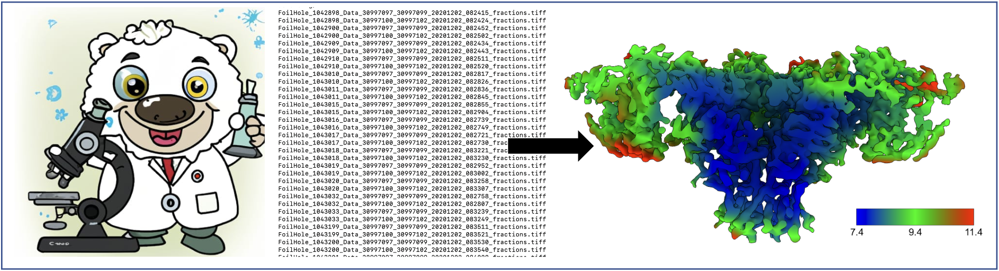
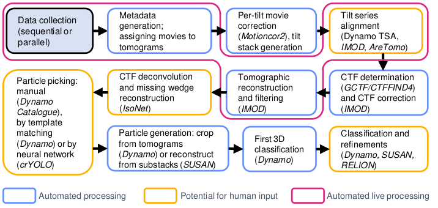

# TomoBEAR

[](https://zenodo.org/badge/latestdoi/675692608)

**TomoBEAR** is a configurable and customizable modular pipeline for streamlined processing of cryo-electron tomographic data and preliminary subtomogram averaging (StA) based on best practices in the scientific research group of Dr. Misha Kudryashev[^1][^2].



Implementation details and benchmarks you can find in our publication:
</br> Balyschew N, Yushkevich A, Mikirtumov V, Sanchez RM, Sprink T, Kudryashev M. Streamlined Structure Determination by Cryo-Electron Tomography and Subtomogram Averaging using TomoBEAR. *Nat Commun* **14**, 6543 (2023). doi: [10.1038/s41467-023-42085-w](https://www.nature.com/articles/s41467-023-42085-w)


## Contents

- [Quick start](#quick-start)
- [Documentation and licensing](#documentation-and-licensing)
- [Changes and releases](#changes-and-releases)
- [Feedback and contribution](#feedback-and-contribution)
- [Citation](#citation)
- [Acknowledgements](#acknowledgements)
- [Contacts](#contacts)

## Quick start

### Video-tutorials

We have prepared a range of short (8-12 min) video-tutorials explaining setup, usage and example output of the ```TomoBEAR``` to help you get started with ```TomoBEAR``` based on the [ribosome tutorial](https://github.com/KudryashevLab/TomoBEAR/wiki/Tutorials):
* [Video 1](https://youtu.be/2uizkE616tE): how to get the latest ```TomoBEAR``` version and configure ```TomoBEAR``` and its dependencies;
* [Video 2](https://youtu.be/N93tfAXp990): description of the project configuration file and the pipeline execution;
* [Video 3](https://youtu.be/qbkRtMJp0eI): additional configuration file parameters description, ```TomoBEAR```-```IMOD```-```TomoBEAR``` loop for checking tilt series alignment results and fiducials refinement (if needed);
* [Video 4](https://youtu.be/BP2T_Y7BiDo): checking on further intermediate results (alignment, CTF-correction, reconstruction, template matching).

### Pipeline structure

In the following picture you can see a flow chart of the main `TomoBEAR` processing steps. As the basic input data you can use raw frame movies or already assembled tilt stacks. More on input formats you [can read here](https://github.com/KudryashevLab/TomoBEAR/wiki/Usage.md#input-data-file-formats).



Blue boxes outline the steps that are performed fully automatically, green boxes may require human intervention. The steps encapsulated in the red frame represent the functionality of live data processing. More detailed diagram [is located on wiki](https://github.com/KudryashevLab/TomoBEAR/wiki).

> **Note**
> <br/> Full MATLAB (source code) version of `TomoBEAR` supports workstations and single interactive nodes with GPUs on the computing clusters at the moment. We are also working towards enabling the support of binaries on the mentioned systems as well as support of both source code and binary versions of the `TomoBEAR` on HPC clusters.

## Documentation and licensing

Detailed information on the installation, setup and usage as well as tutorials and example results can be found in the corresponding [wiki](https://github.com/KudryashevLab/TomoBEAR/wiki).

Please, see the [LICENSE file](LICENSE.md) for the information about how the content of this repository is licensed.

## Changes and releases

The [CHANGELOG file](CHANGELOG.md) contains all notable changes corresponding to the different `TomoBEAR` releases, which are available at the [Releases page](https://github.com/KudryashevLab/TomoBEAR/releases).

If you want to clone a specific ```TomoBEAR``` version, please refer to the **Setup > Get source code and binary > Clone specific version** section on the wiki page [Installation and Setup](https://github.com/KudryashevLab/TomoBEAR/wiki/Installation-and-Setup.md).

## Feedback and contribution

In case of any questions, issues or suggestions you may interact with us by one of the following ways:
* open an issue/bug report, feature request or post a question using [Issue Tracker](https://github.com/KudryashevLab/TomoBEAR/issues);
* write an e-mail to [Misha Kudryashev](mailto:misha.kudryashev@gmail.com) or [Artsemi Yushkevich](mailto:Artsemi.Yushkevich@mdc-berlin.de);
* start a discussion in [Discussions](https://github.com/KudryashevLab/TomoBEAR/discussions);

If you wish to contribute, please, fork this repository and make a pull request back with your changes and a short description. For further details on contribution plase read our [contribution guidelines](CONTRIBUTING.md). 

## Citation

If you use `TomoBEAR` or its parts in your research, please **cite both** `TomoBEAR` and **all external software packages** which you have used under `TomoBEAR`.

The `TomoBEAR` modules dependencies on third-party software are listed on the page [Modules](https://github.com/KudryashevLab/TomoBEAR/wiki/Modules.md) and the list of the corresponding references to cite is located on the page [External Software](https://github.com/KudryashevLab/TomoBEAR/wiki/External-Software.md).

## Acknowledgements

We are grateful to the following organizations:
- Buchmann family and [BMLS (Buchmann Institute for Molecular Life Sciences)](https://www.bmls.de) for supporting this project with their starters stipendia for PhD students;
- [DFG (Deutsche Forschungsgesellschaft)](https://www.dfg.de) for funding the project.

As well we are grateful to the [structural biology scientific research group of Werner Kühlbrandt](https://www.biophys.mpg.de/2207989/werner_kuehlbrandt) at the [MPIBP (Max Planck Institute of Biophysics)](https://www.biophys.mpg.de) and the [MPIBP](https://www.biophys.mpg.de) in Frankfurt (Hesse), Germany for support.

The authors thank as well the following people:
* Dr. Daniel Castano-Diez, Dr. Kendra Leigh and Dr. Christoph Diebolder and Dr. Wolfgang Lugmayr for useful discussions;
* Uljana Kravchenko, Xiaofeng Chu, Giulia Glorani for testing the developmental versions and providing feedback,
* Ricardo Sanchez for producing MATLAB version of the [SUSAN framework](https://github.com/rkms86/SUSAN) in order to be compatible with TomoBEAR;
* Juan Castillo from the Max Planck Institute for Biophysics for the IT support at the Max Planck for Biophysics,
* the high-performance computing team at the MDC for supporting our operation at the Max-Cluster.

We would like to acknowledge as well that TomoBEAR contains modified pieces of MATLAB source code of the Dynamo package developed by Dr. Daniel Castaño-Díez et al.: https://www.dynamo-em.org.

## Contacts
* Prof. Dr. Misha Kudryashev[^1][^2] ([e-mail](mailto:misha.kudryashev@gmail.com?subject=[GitHub]%20TomoBEAR)) - `TomoBEAR` project leader, Principal Investigator;

* Nikita Balyschew[^2] - `TomoBEAR` core version developer, alumni Ph.D. student.

* Artsemi Yushkevich[^1] ([e-mail](mailto:Artsemi.Yushkevich@mdc-berlin.de?subject=[GitHub]%20TomoBEAR)) - `TomoBEAR` contributing developer, Ph.D. student.

* Vasilii Mikirtumov[^1] ([e-mail](mailto:mikivasia@gmail.com?subject=[GitHub]%20TomoBEAR)) - `TomoBEAR` application engineer, Ph.D. student.


[^1]: [In situ Structural Biology Group](https://www.mdc-berlin.de/kudryashev) at the [MDCMM (Max Delbrück Center of Molecular Medicine)](https://www.mdc-berlin.de) in Berlin, Germany.
